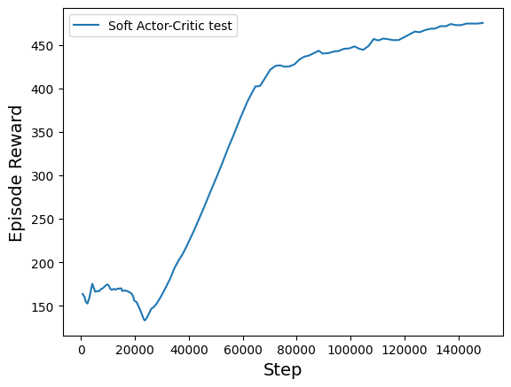
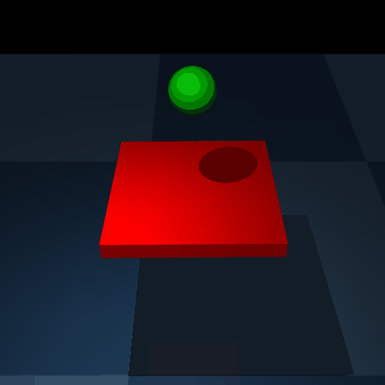

## How to create Gymnasium enviroment from your MuJoCo model?

This example shows how to create a simple custom MuJoCo model and train a reinforcement learning agent using the Gymnasium shell and algorithms from StableBaselines.

To reproduce the result you will need python packages [MuJoCo](https://mujoco.readthedocs.io/en/stable/python.html), [Gymnasium](https://gymnasium.farama.org/index.html) and [StableBaselines3](https://stable-baselines3.readthedocs.io/en/master/) with the appropriate versions:

```
pip install -r requirements.txt
```
## Results of custom model

A simple ball balancing environment was implemented as a starting point. The observation consisted of 10 values (position and speed for rotating the platform along two axes and moving the ball along three axes). Each step the agent received a reward of 1 until he fell off the platform or the episode ended (500 steps by default). The Soft Actor Critic algorithm learned an acceptable policy in 150,000 steps.




<br clear="left"/>


## What to change for your own environment?

1. The model in MJCF format is located in the [assets](https://github.com/denisgriaznov/CustomMuJoCoEnviromentForRL/tree/master/assets) folder. Place the xml file of your own model there. Configure it with the necessary joints and actuators.

2. By running the [model_viewer.py](https://github.com/denisgriaznov/CustomMuJoCoEnviromentForRL/blob/master/model_viewer.py) file, you can test all actuators, as well as the physics of the model in general, in a convenient interactive mode. To do this, run the following command:

```
python model_viewer.py --path path/towards/your/xml/file
```

3. Create your own environment class similar to [BallBalanceEnv](https://github.com/denisgriaznov/CustomMuJoCoEnviromentForRL/blob/master/ball_balance_env.py). 

- In the ```__init__``` method, replace the model path with your own, and insert your observation shape into ```observation_space``` (size of observation).

- In the ```step``` method, define the reward for each step, as well as the condition for the end of the episode.

- In the ```reset_model``` method, define what should happen at the beginning of each episode (when the model is reset). For example, initial states, adding noise, etc.

- In the ```_get_obs``` method, return your observations, such as the velocities and coordinates of certain joints.

4. In the file [learn.py](https://github.com/denisgriaznov/CustomMuJoCoEnviromentForRL/blob/master/learn.py), create an instance of your class (instead of BallBalanceEnv). Then you can choose a different algorithm or use your own, now your environment has all the qualities of the Gym environment.

5. In the file [test.py](https://github.com/denisgriaznov/CustomMuJoCoEnviromentForRL/blob/master/test.py) you can test your agent by specifying the path to the model saved after training. You can also create a GIF from frames (commented code) :)
